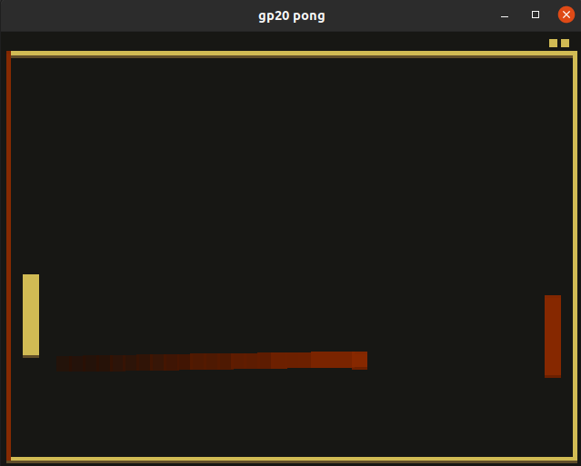

# Not Pong

Author: Fengying Yang

Design: Added a color-matching mechanic to Pong game. If the color of paddles mismatch with the color of the ball, player will lose point.

Screen Shot:

How To Play:

The player can control the left yellow paddle with the mouse moving it up or down. The goal is to use the paddle to catch the ball which has the same color as your paddle. The color of the ball will change whenever it hits the wall or paddles. So the player needs to predict the color of the ball when it comes close to the paddle. The Player will lose one point if he/she fails to catch the yellow ball or accidentally catches the red ball. It becomes challenging when the speed of the ball becomes higher and higher.

This game was built with [NEST](NEST.md).
